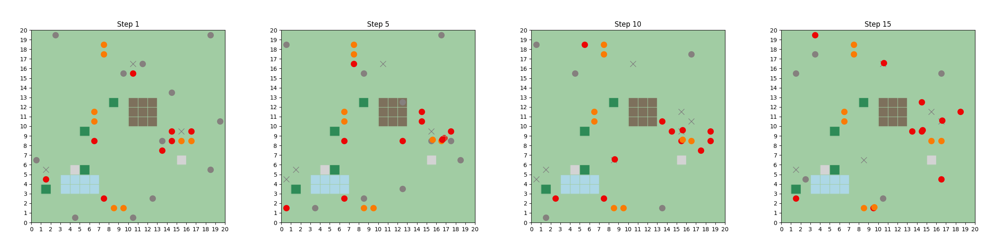
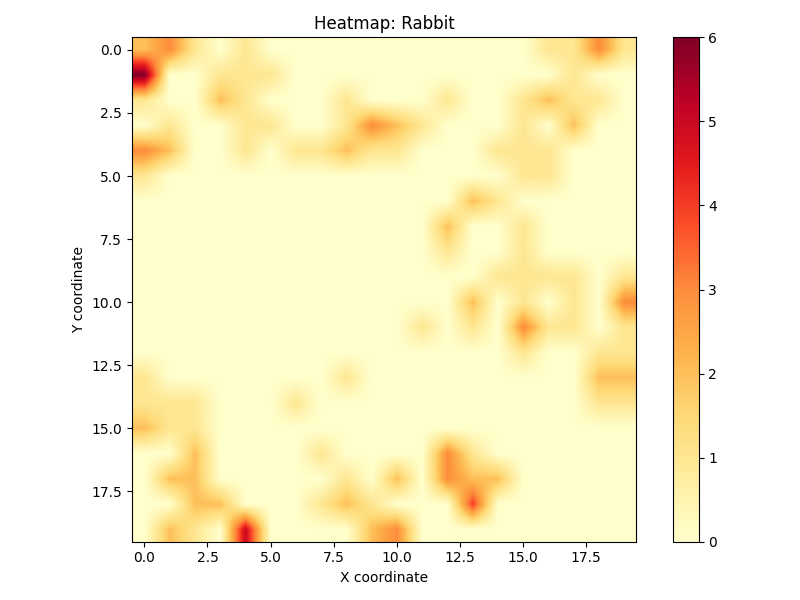
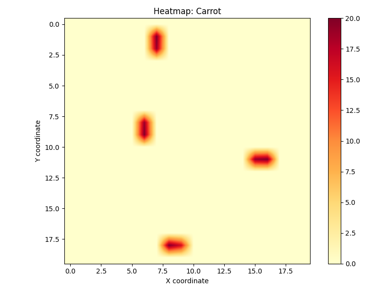
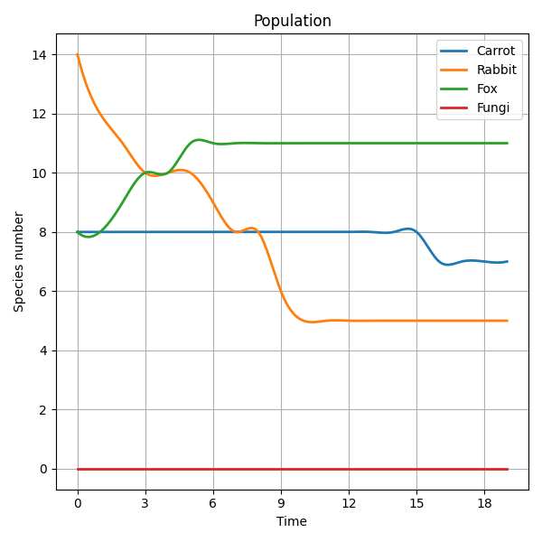

Ecosim Toolbox: Animal Ecosystem Simulation
==========================================

Ecosim is a modular, agent-based ecosystem simulation framework written in Python. It allows researchers and students to model, visualize and analyze the interactions of species within a simulated environment. The simulation incorporates terrain effects, species-level behaviors, trophic interactions and detailed statistical tracking.

Features
--------

- Agent-based modeling with customizable behaviors (e.g. ``chase``, ``flee``, ``random_move``)
- Modular project structure (``core``, ``logic``, ``simulation``, ``visualizer``, ``statistic_tools``)
- Grid-based terrain including water, hills, shelters and blocked zones
- Support for producers, consumers, decomposers, omnivores across trophic levels
- Matplotlib visual output and JSON statistical exports
- Interactive plots and Colab support via `ecosim_colab.ipynb <https://colab.research.google.com/drive/1ZLftvj7A9WAEP6Cm6KsOWO0uePUy_aRx?usp=sharing>`_
- Online documentation hosted at `ReadTheDocs <https://ecosim.readthedocs.io/en/latest/>`_

Citation
--------

If you use Ecosim for your work, please consider citing the GitHub repository::

    @misc{ecosim,
      author = {Schleier, Anna and Vitos, Anikó and Tóth, Tamás Bence},
      title = {Ecosim Toolbox: Animal Ecosystem Simulation},
      year = {2025},
      howpublished = {\url{https://github.com/schan45/ecosim}}
    }

Introduction
------------

**Ecosim** is an open-source, Python-based simulation toolbox designed to model dynamic interactions within artificial ecosystems. At its core, Ecosim uses an agent-based modeling (ABM) approach, where each organism is simulated individually with its own properties, behaviors, and energy levels. The framework provides a virtual 2D grid environment where organisms move, interact, hunt, escape, reproduce, and eventually die, all driven by customizable ecological rules.

The simulation supports various trophic levels—from producers (e.g. plants) to consumers (e.g. herbivores, carnivores, omnivores) and decomposers. Through a flexible food web configuration, users can define which species are prey or predators, and how energy is transferred throughout the ecosystem. The spatial environment also affects survival and behavior through terrain types such as water, hills, shelters, and obstacles.

Ecosim is intended for:

- Educational purposes (biology, ecology, AI behavior modeling)
- Research experimentation in complex systems and ecosystems
- Statistical analysis and visualization of emergent ecological patterns

Its modular architecture makes it easy to extend or modify species behaviors, reproduction logic, environmental rules, and visualization. Whether you are an ecology student, a data scientist, or a simulation enthusiast, Ecosim offers a foundation to explore life-like interactions in a simplified but insightful virtual world.

Description
-----------

The `ecosim` toolbox simulates the dynamic interactions of multiple species in a shared environment using an agent-based, grid-oriented model. Each organism in the simulation acts as an autonomous agent, making decisions based on its current energy, environment, nearby threats, and available resources.

At every discrete time step, the simulation performs the following sequence:

1. **Movement**:
   Each organism may move randomly or purposefully (e.g. chasing prey or fleeing predators), with terrain features (like hills or water) influencing movement cost or accessibility.

2. **Interactions**:
   Predators will attempt to hunt prey within a defined radius. Prey species may flee from predators, while decomposers like fungi consume dead organisms to recycle energy.

3. **Energy Management**:
   Every movement or interaction consumes energy. If an organism's energy drops to zero, it dies. Consuming prey or photosynthesizing (for producers) replenishes energy.

4. **Statistics Logging**:
   Each timestep logs population sizes, interactions, movement paths, and environment data. This enables analysis and visualizations post-simulation.

5. **Visualization**:
   Matplotlib renders spatial frames and statistical charts to track species behavior over time.

Sample Scenario: 3-Level Food Web
^^^^^^^^^^^^^^^^^^^^^^^^^^^^^^^^^

- 🥕 `Carrot`: A **Producer** that occupies random grid locations and reproduces under certain conditions.
- 🐰 `Rabbit`: A **Primary Consumer** that feeds on Carrots and moves frequently.
- 🦊 `Fox`: A **Secondary Consumer** that hunts Rabbits and adapts its path based on prey location.
- 🍄 `Fungi`: A **Decomposer** that recycles energy from dead organisms (Carcasses).

Simulation setup:

.. code-block:: json

   {
     "Carrot": { "type": "Producer", "initial_count": 20 },
     "Rabbit": { "type": "Consumer", "trophic_level": "primary", "initial_count": 15 },
     "Fox":    { "type": "Consumer", "trophic_level": "secondary", "initial_count": 7 },
     "Fungi":  { "type": "Decomposer", "decomposition_rate": 3 }
   }

.. code-block:: json

   {
     "Rabbit": ["Carrot"],
     "Fox": ["Rabbit"]
   }

Ecosystem Evolution over Time
-----------------------------

These snapshots highlight the shift in organism distribution as Rabbits consume Carrots and Foxes begin to cluster around prey-dense zones:

Heatmaps: Species Movement Density
----------------------------------

Each heatmap illustrates where each species spent the most time during the simulation. Redder zones indicate higher frequency.

.. image:: img/heatmap_fox.png
   :width: 30%

Population Dynamics Over Time
-----------------------------

This chart summarizes species count during the simulation window, revealing collapse and stabilization patterns.

Notably:

- Carrots initially decline due to Rabbit consumption.
- Rabbits are later reduced due to increased Fox predation.
- Foxes stabilize once prey concentration decreases.
- Fungi remain constant here due to their passive decomposition role.

This modular simulation framework is ideal for studying:

- Trophic cascades
- Spatial competition
- Predator-prey oscillations
- Terrain influence on species behavior
- Energy transfer and ecosystem collapse

Installation
------------

Available on pip, with the command:

.. code-block:: bash

   pip install ecosim

pip project: https://pypi.org/project/ecosim/

Requirements
------------

.. code-block:: text

   Python == 3.10
   numpy==1.26.4
   matplotlib==3.8.4
   imageio==2.37.0
   Pillow==10.3.0
   scipy==1.13.1
   seaborn==0.13.2

Project Structure
-----------------

.. code-block:: text

   ecosim/
  ├── core/                  # Domain objects and ecosystem logic
  │   ├── foodweb.py         # FoodWeb: species types, trophic levels, predation
  │   └── organism.py        # Base Organism, Producer, Consumer classes
  │
  ├── logic/                 # Agent behavior logic
  │   └── behaviour.py       # Movement, predation, escape, eating rules
  │
  ├── simulation/            # Simulation engine and setup
  │   └── engine.py          # Core simulation loop and terrain application
  │
  ├── statistic_tools/       # Statistical analysis and output
  │   ├── heatmap.py         # Movement heatmap export
  │   └── population.py      # Population over time plot
  │
  ├── visualizer/            # Plotting and animation tools
  │   └── plot.py            # Per-step snapshot visualization
  │
  ├── configs/               # JSON configuration files
  │   ├── foodweb_config.json    # Species and interaction setup
  │   └── terrain_config.json    # Terrain cell types and layout
  │
  ├── frames/                # Automatically generated simulation images
  │
  ├── statistics_plots/      # Output figures (e.g. population graphs, heatmaps)
  │
  ├── docs/                  # Sphinx documentation
  │   ├── conf.py, index.rst, etc.
