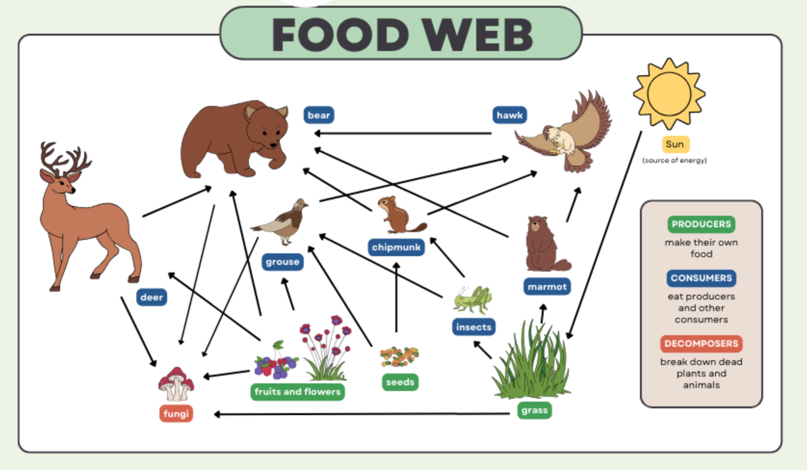

Ecosim Toolbox: Animal Ecosystem Simulation
===========================================

Ecosim is an open-source Python-based simulation toolkit designed to model the complex dynamics of animal ecosystems. Its goal is to provide a modular, visual, and educational environment where users can explore biodiversity, species interactions, and environmental influences in a virtual habitat.

About the Toolbox
-----------------

At the core of Ecosim lies a simulation engine that orchestrates the movement, reproduction, death, and interaction of various organisms over a customizable grid-based terrain. Users can define species, their trophic relationships (such as predator-prey), and assign behavioral logic using configuration files. Each simulation step is visualized with clear grid-based plots that show organisms in their environment and allow tracking over time.

Food Web Overview
-----------------

A food web represents the complex network of feeding relationships within an ecosystem. In this simulation, the food web is defined using a structured JSON file (`foodweb.json`), where species are connected by who eats whom.

The example shown above includes the following relationships:

* **Producers**:
  * Grass
  * Fruits and flowers
  * Seeds

* **Primary consumers (herbivores)**:
  * Deer eats grass
  * Chipmunk eats seeds
  * Grouse eats fruits and flowers
  * Insects eat grass

* **Secondary/Tertiary consumers (carnivores or omnivores)**:
  * Bear eats deer, chipmunk, grouse, and insects
  * Hawk eats chipmunk and grouse
  * Marmot eats insects
  * Grouse may also eat insects

* **Decomposers**:
  * Fungi break down dead organisms such as deer and plants

These trophic interactions define energy transfer pathways and help simulate realistic predator-prey dynamics in the virtual environment.
